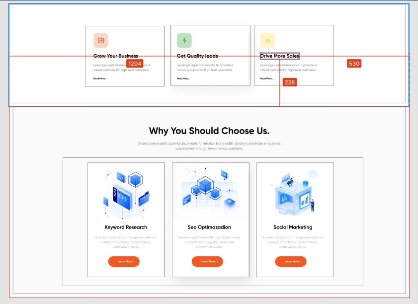

< Урок 5. Основы позиционирования ч.2 >

Для тех кто не был на семинаре необходимо пройти игру 
* http://flexboxfroggy.com/#ru
* https://cssgridgarden.com/#ru

Мы продолжаем работать с проектом из прошлого урока:

https://www.figma.com/file/mnLY69cYE5cqWM5w6n5hXx/Seo-%26-Digital-Marketing-Landing-Page?node-id=186%3A47 (смотрите HomeWork5)

В данном домашнем задании мы будем добавлять стилистику и позиционирование для следующего блока сайта

Добавить весь контент из макета
Ко всем элементам контента добавить классы
Добавить стили для всего контента сайта
Расставить элементы в соответствии с макетом

